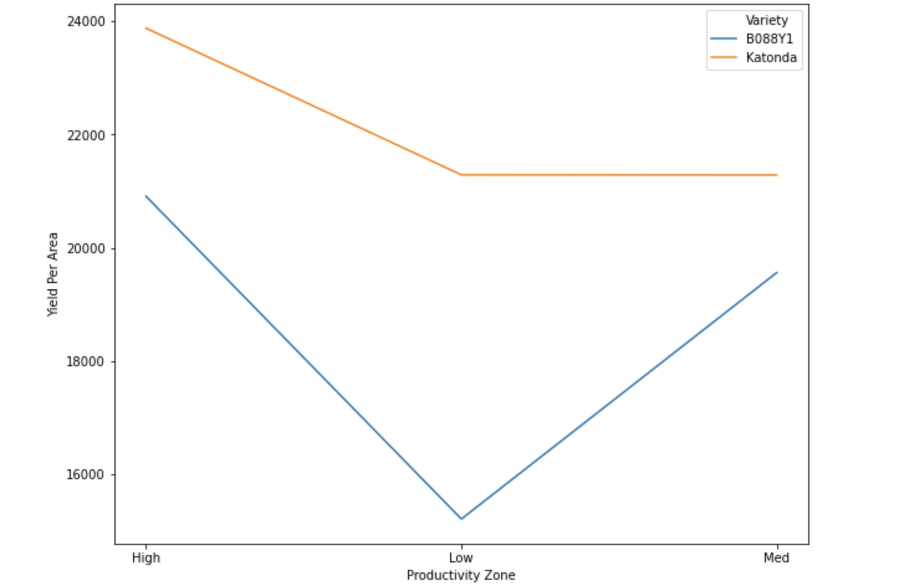
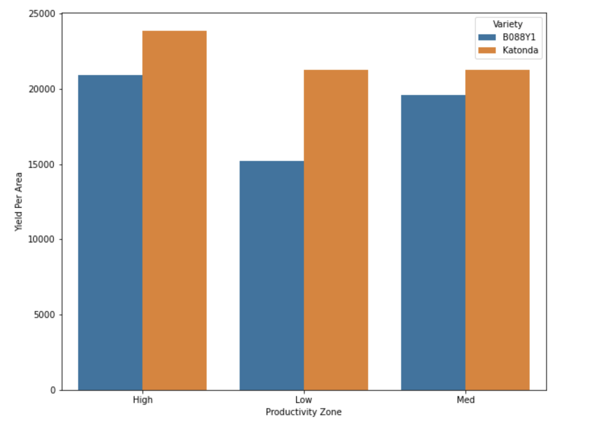
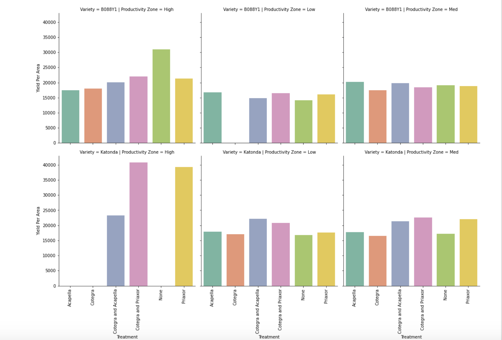

# farming-data-insights

I have developed this notebook to perform a data insight test organized by "Deveron UAS".
The main task was to perform a detailed analysis on the data and gather some important insights to improve the farming experience.

# Determining which variety performs best

# Determining which fungicide gives best yield

